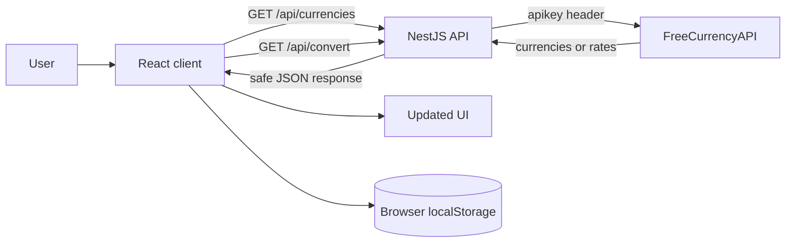

# Project Creation and Flow Guide

This guide explains how the TA Solutions Currency Converter was created, how data moves through it, and what every important file does.

## 1. Project overview

The project is a small full-stack monorepo:

- `client/` is a React + TypeScript + Vite application.
- `server/` is a NestJS + TypeScript API.
- Bootstrap supplies the responsive UI foundation.
- FreeCurrencyAPI supplies the supported currencies and exchange rates.
- Browser `localStorage` keeps conversion history after a refresh.

The browser never receives the FreeCurrencyAPI key. It only calls the NestJS server. The server reads the secret from `server/.env` and contacts FreeCurrencyAPI on the user's behalf.

## 2. High-level request flow



There are two separate kinds of storage:

- The API key is stored privately on the server in `server/.env`.
- Conversion history is stored in the current user's browser under `flux-conversion-history-v1`.

No conversion history is stored on the NestJS server.

## 3. How the project was created

### Step 1: Create the monorepo structure

The repository was divided into `client` and `server` npm workspaces. The root `package.json` coordinates both applications, so one command can install, start, build, or test the whole project.

Conceptually, the initial structure was:

```text
ta-solutions-currency-converter/
├── client/
├── server/
└── package.json
```

### Step 2: Configure the React client

The client was set up with React, TypeScript, and Vite. Bootstrap and Bootstrap Icons were installed for layout, form controls, utilities, icons, and responsive behavior.

The entry point imports Bootstrap before the project's custom stylesheet. This lets `styles.css` refine Bootstrap's standard appearance.

### Step 3: Build the main converter UI

`App.tsx` was implemented entirely with a functional component and hooks:

- `useState` manages currencies, form fields, loaders, errors, and results.
- `useEffect` loads the supported currencies when the page opens.
- `useMemo` calculates the latest selectable historical date.
- `useLocalStorage` persists completed conversions.

Reusable currency-select and history-list components keep the main component readable.

### Step 4: Configure the NestJS server

The server was set up with NestJS modules, controllers, services, validation, configuration, and the NestJS Axios wrapper.

The server exposes three public routes:

```text
GET /api/health
GET /api/currencies
GET /api/convert?from=USD&to=EUR&amount=100
GET /api/convert?from=USD&to=EUR&amount=100&date=2024-01-15
```

### Step 5: Connect to FreeCurrencyAPI securely

`CurrencyService` sends the API key in an `apikey` HTTP header. This is important because environment variables prefixed with `VITE_` are included in frontend builds and would be public.

The backend uses these upstream endpoints:

- `/v1/currencies` for the dynamic supported-currency list.
- `/v1/latest` for the latest available exchange rate.
- `/v1/historical` for a rate from a selected past date.

### Step 6: Add validation and error handling

The conversion query is converted into a validated DTO. Currency codes must contain exactly three letters, amounts must be positive and limited to a sensible maximum, and dates must use `YYYY-MM-DD`.

The service also verifies that historical dates are between `1999-01-01` and yesterday. Upstream authentication, quota, validation, and availability errors are translated into safer messages for the client.

### Step 7: Add persistent history

After a successful conversion, the client creates a history entry containing:

- A unique local ID
- Source and target currencies
- Original and converted amounts
- Exchange rate
- Historical rate date, when applicable
- The exact time the conversion was performed

The newest entry is placed first and history is limited to 50 items. Updating the state automatically writes the array to `localStorage`.

### Step 8: Add responsive styling

The CSS starts with a one-column mobile layout. At `576px` and wider, the currency controls become a three-column row with the swap button in the middle.

The design includes clear focus states, touch-friendly controls, flexible result typography, reduced-motion support, loaders, empty states, and readable conversion-history cards.

### Step 9: Add tests and deployment configuration

Jest tests the backend mapping, calculation, and date validation. Vitest with Testing Library verifies that the React app loads currencies and enables the form.

`render.yaml` describes the NestJS web service. `netlify.toml` describes the frontend build and single-page application fallback.

## 4. Complete application flow

### Page-load flow

1. `client/index.html` loads the Vite React entry script.
2. `main.tsx` imports Bootstrap, icons, custom CSS, and renders `App`.
3. `App` initially shows the currency loader.
4. Its `useEffect` calls `currencyApi.getCurrencies()`.
5. `api.ts` requests `GET /api/currencies`.
6. During local development, Vite proxies `/api` to `http://localhost:3000`.
7. `CurrencyController` delegates the request to `CurrencyService`.
8. The service checks its 12-hour in-memory currency cache.
9. If the cache is empty, it requests `/v1/currencies` from FreeCurrencyAPI.
10. The service converts the provider's snake-case fields into frontend-friendly camel-case fields and sorts the list by currency code.
11. React stores the returned currencies in state and displays both dropdowns.

### Latest conversion flow

1. The user enters an amount and selects `from` and `to` currencies.
2. The user presses **Convert now**.
3. `handleSubmit` prevents the normal browser form submission and validates the amount.
4. The button enters its loading state and the previous error/result is cleared.
5. `api.ts` builds a URL such as `/api/convert?from=USD&to=EUR&amount=100`.
6. NestJS transforms and validates the query with `ConvertQueryDto`.
7. `CurrencyService` requests `/v1/latest` using the selected base and target currencies.
8. The service multiplies `amount × rate` and returns a normalized result.
9. React renders the result panel.
10. React adds the completed conversion and its current timestamp to history.
11. `useLocalStorage` writes the new history to the browser.

### Historical conversion flow

The flow is the same as a latest conversion, with these differences:

1. The user enables **Use a historical rate**.
2. A date field appears, limited to `1999-01-01` through yesterday.
3. The client includes `date=YYYY-MM-DD` in the request.
4. The server validates that date and requests `/v1/historical`.
5. The provider nests the rates under the requested date, so the service extracts `data[date][targetCurrency]`.
6. The result and history entry show which historical date supplied the rate.

### Reload and persistence flow

1. `useLocalStorage` runs its state initializer when React starts.
2. It reads `flux-conversion-history-v1` from the browser.
3. Valid JSON is restored into React state.
4. `HistoryList` renders the saved entries with the user's localized date and time.
5. If storage is unavailable or malformed, the application safely uses an empty array.

## 5. Root files

### `package.json`

Defines the npm workspaces and shared commands:

- `npm run dev` starts the client and server together with `concurrently`.
- `npm run build` builds the server, then the client.
- `npm start` starts the compiled NestJS server.
- `npm test` runs server tests, then client tests.

### `package-lock.json`

Locks exact dependency versions so local machines and deployment platforms install a repeatable dependency tree. It should be committed.

### `.env.example`

Documents the environment variables needed by the server without containing a real secret.

### `.gitignore`

Prevents dependencies, compiled output, environment secrets, logs, and generated TypeScript build metadata from being committed.

### `README.md`

Provides the short project overview, local setup commands, API route list, Git instructions, and Render/Netlify deployment steps.

### `PROJECT_GUIDE.md`

This detailed architecture and file-flow guide.

### `netlify.toml`

Tells Netlify to:

- Build the React workspace.
- Publish `client/dist`.
- Use Node.js 20.
- Redirect unknown routes to `index.html` for single-page application routing.

### `render.yaml`

Describes a Render Node web service that installs dependencies, builds the NestJS workspace, starts the compiled server, and checks `/api/health`.

## 6. Client files

### `client/package.json`

Contains React, Bootstrap, Bootstrap Icons, Vite, TypeScript, Vitest, jsdom, and Testing Library dependencies. It also defines client-only development, build, preview, and test commands.

### `client/index.html`

The browser document shell. It contains the root `<div>` where React mounts and references `/src/main.tsx` as the application entry.

### `client/src/main.tsx`

The React bootstrap file. It:

1. Imports React and ReactDOM.
2. Imports Bootstrap CSS and Bootstrap Icons.
3. Imports `styles.css`.
4. Renders `<App />` inside React Strict Mode.

### `client/src/App.tsx`

The main UI and orchestration component. Its state includes:

- `currencies`: API-supported currencies
- `from` and `to`: selected currency codes
- `amount`: the input value
- `useHistorical` and `date`: historical mode controls
- `result`: the most recent successful conversion
- `history`: persistent conversion records
- `loadingCurrencies` and `converting`: separate request loaders
- `error`: the current user-facing error message

Its important functions are:

- `localDateString`: creates a date-input-safe local date.
- `formatMoney`: formats values using `Intl.NumberFormat`.
- `swapCurrencies`: exchanges the source and target selections.
- `handleSubmit`: validates, sends, displays, and records a conversion.

### `client/src/api.ts`

Centralizes browser-to-backend communication.

`VITE_API_URL` selects the deployed backend URL. When it is absent locally, the client uses `/api`, which Vite proxies to NestJS.

The private `request` helper handles network failures, JSON parsing, non-2xx responses, and consistent errors. The exported `currencyApi` object provides `getCurrencies` and `convert` methods.

### `client/src/types.ts`

Defines shared frontend TypeScript interfaces:

- `Currency`
- `ConversionResult`
- `HistoryItem`

`HistoryItem` extends `ConversionResult` with a local ID and creation timestamp.

### `client/src/components/CurrencySelect.tsx`

A controlled Bootstrap `<select>` component shared by the **From** and **To** fields. It receives its label, value, currencies, and change handler through props.

### `client/src/components/HistoryList.tsx`

Displays either an empty state or saved conversions. It formats the conversion time for the user's locale and indicates whether an entry used the latest or a historical rate. It also owns the **Clear all** button UI, while `App` owns the actual state change.

### `client/src/hooks/useLocalStorage.ts`

A reusable custom hook that mirrors React state to `localStorage`:

- Its lazy initializer reads saved JSON only on initial mount.
- Its effect writes whenever the key or value changes.
- Both operations use `try/catch`, so blocked or unavailable storage does not break the application.

### `client/src/styles.css`

Contains the visual system and responsive layout. Bootstrap handles the baseline components; this file supplies colors, spacing, cards, gradients, typography, focus styles, mobile layout, the desktop breakpoint, and reduced-motion behavior.

### `client/src/App.test.tsx`

Uses Vitest and React Testing Library. It mocks `fetch`, supplies test currencies, renders the application, checks the initial loader, waits for the currencies, and verifies that the form becomes usable.

### `client/src/vite-env.d.ts`

Adds Vite's client-side TypeScript definitions, including `import.meta.env`.

### `client/vite.config.ts`

Enables the React Vite plugin and configures the local development server:

- Client port: `5173`
- `/api` proxy target: `http://localhost:3000`

The proxy avoids browser cross-origin complexity during local development.

### `client/tsconfig.json`

The top-level client TypeScript project file. It references the separate application and Vite configuration projects.

### `client/tsconfig.app.json`

TypeScript settings for browser source files, React JSX, DOM APIs, strict checking, and Vite-style module resolution.

### `client/tsconfig.node.json`

TypeScript settings for `vite.config.ts`, which runs in Node rather than in the browser.

## 7. Server files

### `server/package.json`

Contains NestJS, Axios integration, configuration, validation, RxJS, Jest, and TypeScript dependencies. It defines the server's build, watch-development, production-start, and test commands.

### `server/.env.example`

Documents server configuration:

```env
CURRENCY_API_KEY=your_freecurrencyapi_key
PORT=3000
CLIENT_URL=http://localhost:5173
```

The real `server/.env` is intentionally ignored by Git.

### `server/src/main.ts`

Bootstraps NestJS. It:

1. Creates the application from `AppModule`.
2. reads allowed client origins from `CLIENT_URL`.
3. Adds the global `/api` prefix.
4. Enables CORS for the configured frontend origins.
5. Enables global DTO transformation, validation, and unknown-field removal.
6. Listens on the configured port and all network interfaces.

`CLIENT_URL` supports comma-separated URLs, which is useful when both local and deployed clients need access.

### `server/src/app.module.ts`

The root NestJS module. It loads environment configuration globally, imports `CurrencyModule`, and registers `HealthController`.

### `server/src/health.controller.ts`

Implements `GET /api/health`. It returns a status and timestamp for manual checks and Render health monitoring.

### `server/src/currency/currency.module.ts`

Groups the currency feature. It imports `HttpModule` with a timeout, registers `CurrencyController`, and provides `CurrencyService` through NestJS dependency injection.

### `server/src/currency/currency.controller.ts`

Defines the public currency endpoints. Controllers stay thin: they accept HTTP requests and delegate business logic to `CurrencyService`.

### `server/src/currency/convert-query.dto.ts`

Defines and validates conversion query parameters:

- Currency codes are trimmed and converted to uppercase.
- Currency codes must match three alphabetic characters.
- Amounts are transformed from query strings into numbers.
- Amounts must be positive and below the maximum.
- Optional dates must use `YYYY-MM-DD`.

### `server/src/currency/currency.service.ts`

Contains the main backend business logic:

- Retrieves and normalizes supported currencies.
- Caches the currency list for 12 hours to reduce quota use.
- Chooses the latest or historical upstream endpoint.
- Sends the secret API key in a server-side header.
- Extracts the requested target rate.
- Calculates the converted result.
- Validates historical date boundaries.
- Maps provider errors to appropriate NestJS HTTP exceptions.

Important private helpers:

- `mapCurrencies`: converts provider fields and sorts currencies.
- `authHeaders`: reads the private API key.
- `validateHistoricalDate`: enforces valid past dates.
- `throwApiError`: provides consistent safe errors.

### `server/src/currency/currency.service.spec.ts`

Mocks the HTTP client so backend tests do not spend API quota. It tests currency normalization/sorting, latest conversion calculation, and rejection of today's date as a historical date.

### `server/jest.config.js`

Configures Jest and `ts-jest` to discover and execute TypeScript files ending in `.spec.ts`.

### `server/nest-cli.json`

Tells the Nest CLI that the project uses TypeScript source under `src`.

### `server/tsconfig.json`

Contains strict server TypeScript settings plus the decorator metadata required by NestJS dependency injection and validation.

### `server/tsconfig.build.json`

Extends the server TypeScript settings for production compilation while excluding tests and build output.

## 8. Environment variables

### Local backend

Create `server/.env`:

```env
CURRENCY_API_KEY=your_real_key
PORT=3000
CLIENT_URL=http://localhost:5173
```

### Deployed backend

Set these in Render rather than committing them:

```text
CURRENCY_API_KEY = your real key
CLIENT_URL = https://your-site.netlify.app
```

### Deployed frontend

Set this in Netlify:

```text
VITE_API_URL = https://your-render-service.onrender.com/api
```

Only the backend URL is safe to expose through Vite. Never create `VITE_CURRENCY_API_KEY`.

## 9. Running and testing locally

From the repository root:

```bash
npm install
npm run dev
```

Open:

```text
Frontend: http://localhost:5173
Backend:  http://localhost:3000/api
Health:   http://localhost:3000/api/health
```

Run all tests:

```bash
npm test
```

Create production builds:

```bash
npm run build
```

Preview the compiled frontend:

```bash
npm run preview -w client
```

## 10. Manual test checklist

1. Open the page in a narrow mobile viewport.
2. Confirm the loader appears before the currency dropdowns.
3. Confirm multiple API-supported currencies are available in both dropdowns.
4. Convert a positive amount and verify a result appears.
5. Swap currencies and convert again.
6. Enable historical mode and select a date before today.
7. Confirm the historical date appears with the result.
8. Refresh the page and confirm conversion history remains.
9. Confirm each history row shows a date and time.
10. Clear history and refresh to confirm it remains empty.
11. Try zero, a negative amount, and an invalid URL query to verify validation.
12. Temporarily stop the backend to verify that the client displays a friendly error.

## 11. Git workflow

The repository is already connected to GitHub. For future changes:

```bash
git status
git add .
git commit -m "Explain the change"
git push
```

Always run `npm test` and `npm run build` before pushing. Confirm `server/.env` never appears in `git status`.

## 12. Deployment flow

1. Push the current `main` branch to GitHub.
2. Create the backend on Render using `render.yaml`.
3. Add `CURRENCY_API_KEY` to Render.
4. Temporarily set `CLIENT_URL` to the expected Netlify address or update it after Netlify is created.
5. Copy the public Render backend URL.
6. Import the same GitHub repository into Netlify.
7. Set `VITE_API_URL` to the Render URL followed by `/api`.
8. Deploy Netlify.
9. Set Render's `CLIENT_URL` to the exact Netlify origin and redeploy the backend.
10. Test currencies, current conversions, historical conversions, and history persistence on the public URL.

The frontend and backend must both be deployed. A static Netlify deployment alone cannot safely access FreeCurrencyAPI because the API key must remain on the backend.

## 13. Common troubleshooting

### “Currency API key is not configured”

Create `server/.env`, add `CURRENCY_API_KEY`, and restart NestJS.

### The frontend cannot reach the backend locally

Confirm both processes are running and ports `5173` and `3000` are available. Start both with `npm run dev` from the repository root.

### The deployed browser reports a network or CORS error

Check that:

- Netlify's `VITE_API_URL` ends in `/api`.
- Render's `CLIENT_URL` exactly matches the Netlify origin.
- Both services were redeployed after changing environment variables.

### FreeCurrencyAPI returns a quota error

The server translates HTTP 429 into a friendly availability message. Wait for the quota reset or replace the key in the server environment with another valid FreeCurrencyAPI key.

### History is missing in another browser

History is deliberately browser-local. It is not synced between browsers, devices, private windows, or cleared browser profiles.
